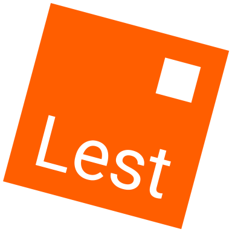

<div align="center">



# Lest

*Test, lest your code break.*

[](https://github.com/lest-luau/lest/actions/workflows/ci.yml)

**Delightful Luau testing — everywhere Luau runs.**

</div>

Lest is a testing toolchain for Luau: a single binary that carries the test
framework inside it. You write `describe` / `it` / `expect` once, and the same
suites run as pure logic, as [Lune](https://lune-org.github.io/docs) or
[Lute](https://github.com/luau-lang/lute) scripts, or against real Roblox engine
APIs in an actual place. One command, one test API, any environment.

```luau
--!strict
local Lest = require('@lest')
local describe, it, expect = Lest.describe, Lest.it, Lest.expect

local cart = require('./cart')

describe('cart', function ()
	it('sums line items', function ()
		expect(cart.total({ 3, 4 })).toBe(7)
	end)

	it('rejects a negative quantity', function ()
		expect(function ()
			cart.total({ -1 })
		end).toThrow('quantity')
	end)
end)

return nil
```

```console
$ lest

unit (native)
  cart
    ✓ sums line items (0.0ms)
    ✓ rejects a negative quantity (0.1ms)

Slowest Tests:
  cart › rejects a negative quantity (0.1ms)
  cart › sums line items (0.0ms)

Test Suites: 1 passed, 1 total
Tests:       2 passed, 2 total
Snapshots:   0 total
Time:        0.01s
```

## Why Lest

- **Nothing to install alongside it.** The framework is compiled into the
binary, not a package you add to your project. The runner and the framework are
always the same version and can never disagree about the protocol between them.

- **Zero configuration.** No `lest.toml`? Every `**/*.spec.luau` runs on the
embedded VM. A real config for a real project is two lines.

- **Four environments, one report.** Pure logic runs on an embedded Luau VM;
`@lune/*` and `@lute/*` scripts run in the actual runtimes; engine code runs in
a real Roblox place through Open Cloud. Results merge into a single report.

- **No engine emulation. Ever.** Nothing here mocks Instances or fakes a
runtime. Partial mocks produce confident wrong tests — if a test needs an
environment, Lest runs it in that environment.

- **Built for the save-run loop.** Watch mode re-runs only the specs whose
transitive requires actually changed.

- **Snapshots, coverage, and CI output.** `toMatchSnapshot` with `-u` to
update, line coverage with lcov and a `--min` gate, JUnit XML, and exit codes
that never conflate a failing test with a broken tool.

## Getting started

Install with [rokit](https://github.com/rojo-rbx/rokit), which pins the version
per project and puts `lest` on your `PATH`:

```console
$ rokit add lest-luau/lest
```

Or build from source with [Rust](https://rustup.rs):

```console
$ git clone https://github.com/lest-luau/lest
$ cd lest
$ cargo build --release
$ ./target/release/lest self install     # copies it into ~/.lest/bin, adds it to PATH
```

Then, in your project:

```console
$ lest init
```

`lest init` detects what it can (a rojo project file, `lune`/`lute` on `PATH`,
existing spec files) and asks only about what it can't infer. It writes a
commented `lest.toml`, an example spec, and — if you accept — a `.luaurc` alias
so specs can `require('@lest')` from anywhere. Pass `--yes` to take every
default without prompting.

Now write a spec and run it:

```console
$ lest                     # every default suite
$ lest run unit            # one suite
$ lest --watch             # re-run affected specs on save
$ lest -t 'cart'           # only tests whose full name contains "cart"
```

Full walkthrough: **[Getting started](docs/getting-started.md)**.

## Backends

A suite's *backend* is where its specs actually execute. You choose it once in
`lest.toml`; everything downstream — reporters, snapshots, filters, CI output —
neither knows nor cares where a test ran.

| Backend | Runs in | Use it for | Coverage | Watch |
| --- | --- | --- | :---: | :---: |
| `native` | An embedded Luau VM inside the CLI | Pure logic. The default, and the fast one | ✅ | ✅ |
| `lune` | A spawned `lune run` process | Scripts using `@lune/*` | — | ✅ |
| `lute` | A spawned `lute run` process | Scripts using `@lute/*`, code transforms, tooling | — | ✅ |
| `cloud` | A real Roblox place via Open Cloud | Instances, services, the DataModel | — | — |

```toml
backend = "native"

[suites.unit]
include = ["src/**/*.spec.luau"]

[suites.engine]
include = ["tests/engine/**/*.spec.luau"]
backend = "cloud"
default = false     # opt in locally; auto-enabled when $CI is set
```

More: **[Backends](docs/backends.md)**.

## Documentation

| Guide | |
| --- | --- |
| [Getting started](docs/getting-started.md) | Install, scaffold, and run your first suite |
| [Writing tests](docs/writing-tests.md) | `describe`, `it`, lifecycle hooks, skipping |
| [Matchers](docs/matchers.md) | Every matcher, with semantics and failure output |
| [Backends](docs/backends.md) | Native, Lune, Lute, and Open Cloud |
| [Configuration](docs/configuration.md) | Every `lest.toml` key |
| [CLI reference](docs/cli.md) | Every command and flag, including watch mode |
| [Snapshots](docs/snapshots.md) | `toMatchSnapshot`, updating, obsolete keys |
| [Coverage](docs/coverage.md) | Line coverage, lcov, and the `--min` gate |
| [Continuous integration](docs/continuous-integration.md) | Exit codes, JUnit, `--changed`, cloud in CI |
| [Contributing](docs/contributing.md) | Repository layout and the development loop |

## Contributing

Issues and pull requests are welcome.
[Contributing](docs/contributing.md) covers the repository layout, the
toolchain, and how Lest tests itself.

## Contributors

<a href="https://github.com/lest-luau/lest/graphs/contributors">
  
</a>

## License

Lest is [MIT licensed](LICENSE).
